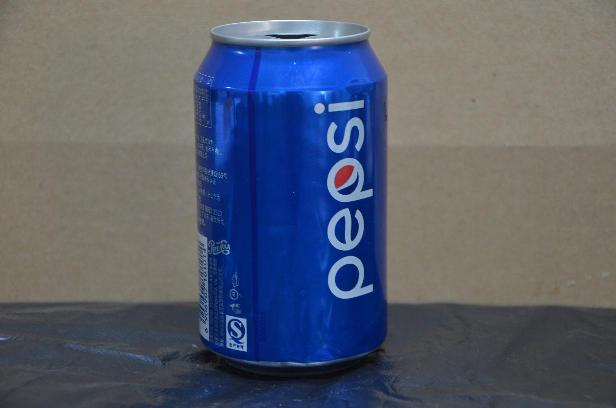
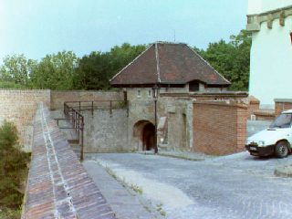

# A system that sorts drinking bottle

A little demo that sorts drinking bottles using CNN. The system is running in Raspberry Pi. The positive training datasets have only 36 pictures. After transformation, the positive training pictures  glow into more than two  hundreds. the negative training pictures using some scene pictures from  [INRIA person datasets](http://pascal.inrialpes.fr/data/human/). The example pictures list as bellow.

 

the positive picture 

the negative picture 

the sorting precision is more 95%.

## Installation Dependencies  

* keras 1.1.0
* TensorFlow / theano
* opencv

